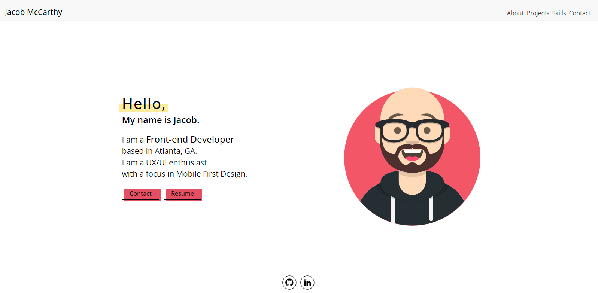

# React Portfolio

## Table of Contents
  
  - [Description](#description)
  - [Development](#development)
  - [Technology](#technology)
  - [Questions](#questions)

  ---

## Description

  This project is my first venture into the world of React! The site is a single page application featuring conditional rendering of individual pages as well as Styled Components for the styling. 

  The site is deployed live with Github Pages and can be found here:
  https://jacobmabob.github.io/react-portfolio/

  

 ## Development
  
  My objective with this project was to learn the basics of React by building a simple portfolio site. React has a little bit of a learning curve, but I found the components to be very intuitive to set up and it makes for a more readable/organized project. My site has the following features:
  
   - Downloadable Resume
   - Single Page Application with conditionally rendered content
   - Contact form created with Formik and EmailJS
   - Styled with Styled Components 
   - Links to six deployed projects as well their github repositories 
   - Fully mobile responsive 

 ## Technology
 - Node.js
 - React
 - Formik
 - Yup
 - Styled Components 
  

  ## Questions
  Have any questions? Feel free to check out my github or send me an Email!

  https://github.com/jacobmabob  
  thejacobmccarthy@gmail.com